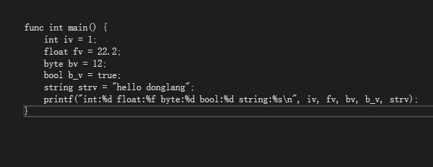
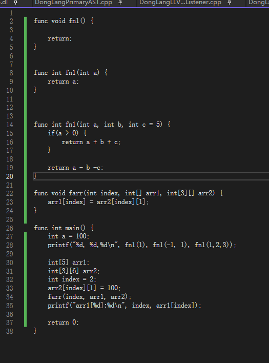
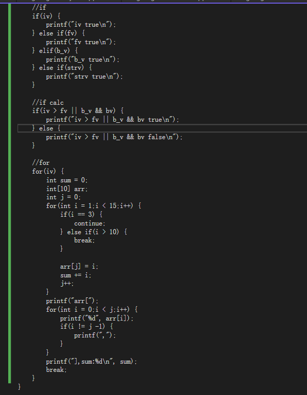

### 一、简介
-------------
#### 使用**Antlr4**(也可以使用flex&bison)和**LLVM16**开发的一个简单的类 **C++** 语言，源码可供参考学习。
  - [Antlr4](https://github.com/antlr/antlr4.git)
  - [LLVM](https://llvm.org/docs/tutorial/MyFirstLanguageFrontend/index.html)
  - [gflag](https://github.com/gflags/gflags.git)
  - flex&bison
  - Visual Studio 2022（社区版即可）
  - wsl2 ubuntu
  - cmake

### 二、源码安装
---------------
#### 1. github[下载源码](https://github.com/SpiritDyn123/DongLang.git)
#### 2. 安装CMakeLists.txt里所缺少的库进行安装
#### 3. 两种启动调试方法
- **wsl** 需要再visualstudio 中查看设置linux远程端口，使用vs的远程调试开发
    - 启动wsl2 建议ubuntu20系统
	- 进入ubuntu，设置sshd的端口为2232 ，启动sshd
	- 点击执行根目录下的WslSSH.bat批处理，映射wsl的ssh端口到127.0.0.1本机

-  **linux** 下直接cmake和gdb调试即可
    - cmake .
	- make
	- ./DongLang执行

- ****建议使用vs远程开发（效率高），编译调试使用cmake，vs远程调试很慢，不方便****

### 三、语法学习
--------------------
#### 示例代码
- [type](./test/type_test.dl)

    
- [function](./test/function_test.dl)

    
- [if_for](./test/cond_if_for_test.dl)

    


#### 1.基本类型 int float byte bool string
```
int a, b = 1; // int 类型 其中b默认值1
byte ba = 1;
float fa = 1.2;
bool  gg = (true|false); 
string str = "hello world"; // 类c char *
	
```
#### 1.指针和数组
```
int * p1, p2; //一级指针 p1 p2,注意这里不同于c（p2是整型）
int **pp1,pp2;

//数组:从左向右来表示多维数组，和c相反
int[] arr = {1,2};					//c: int arr[]
int[3][2] arr2;						 //c: int arr2[][3]
int [2][] arr3 = {{1,2},{2,2}};		 //c: int arr3[][2]

//数组指针
int*[3] arrp;		 //c: int* arrp[3]
int[3]* parr;		 //c: int (*parr)[3]

```
#### 2.算术和逻辑运算
```
//算术运算
a = 1+b;
a = a-b;
a = a/b;
a = c/d;
a = a ^ b;
a = a &b;
a = a | b;
a += b;
a -= 2;
a *= 3;
a /= e;
 .
 .
 .

 //逻辑运算

 a || b
 a && b
!a
a > b
a < b
a >= b
a <= b
a == b
a != b

```

#### 3.if else
```
// else if 和 elif都可以
if(int a = 1;a > 1) {

}
else if(a || b) {

} else if( a > b || a && b) {

} elif(int c = 1) {

} else {

}


```
#### 4.for
```
1. for(true) {
		if(xxx) {
			break;
		}
		continue;
	}

2. for(;;) <==> for(true)

3. for(int i= 0, j =1;i >= 1 && j < 1;i++, j--) {

}
```

#### 5.function
```
1. 基本定义方式
func int fff(int a, int b) {
	return a+b;
}

2.默认值和重载
func int f1(int a) {
}

func int f1(int a, int b) {
}

func int f1(float a = 5.1) {
}

3.不定参数暂时不支持
func int f1(int a, ...) {
}
```
#### 6.TODO template模板

#### 7.TODO class类

### 四、编译
---------------------
1. 文件类型：
- dl代码文件后缀
- ll后缀，
- s汇编后缀（asm)
-  o object文件后缀，
- 可执行后缀自己指定默认（dl.out)

2.生成ll文件
```
./DongLang -in xxx.dl -otype ll
```
3.生成asm文件
```
./DongLang -in xxx.dl -otype asm
./DongLang -in xxx.ll -otype asm
```
4.生成object文件
```
./DongLang -in xxx.dl -otype obj
./DongLang -in xxx.ll -otype obj
./DongLang -in xxx.s -otype obj
```
5.生成可执行文件
```
./DongLang -in xxx.dl -otype exe
./DongLang -in xxx.ll -otype exe
./DongLang -in xxx.s -otype exe
./DongLang -in xxx.o -otype exe
-otype 默认就是exe 可以不写
```
6、TODO支持静态库